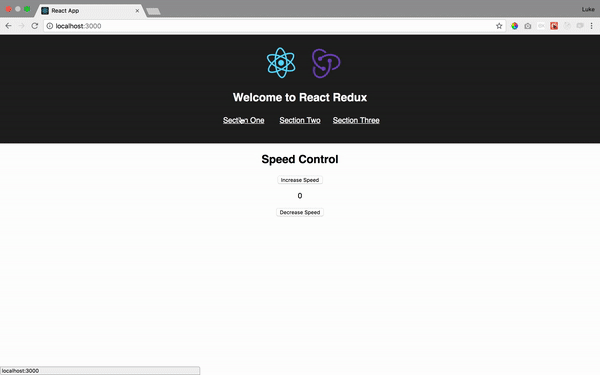

# Redux Code Challenge

## INSTRUCTIONS
Fork this repository and clone it to your computer. Run `npm install` and `npm start`.

There is no database -- all data will be generated by a user, and refreshing will reset the app. No axios, no server.

There are 3 views. Each view needs to be hooked up to redux, with actions and reducers being defined by you. Your reducers (you will need multiple) should all live in the `index.js` file. Don't forget to combine them!

Fulfill the requirements below:

### Speed Control

This component is our interface for speed. Our speed should start at `0`. We need to display the current speed, along with changing it appropriately when we click 'Increase' or 'Decrease' the speed by `1`. There is no need for any local state.

### Passengers

This component is our interface for checking in Passengers. Type in the name. On click of the button, the name should be entered into the list. The list should be displayed and have a default entry of your name. For example, in the solution demo gif, you can see the name `Luke` is displayed on the DOM before any input. You may use local state for the input box, but use redux to store the passengers array.

### Dashboard

This component is our Dashboard. It should display our current speed and the number of passengers currently on board. 

